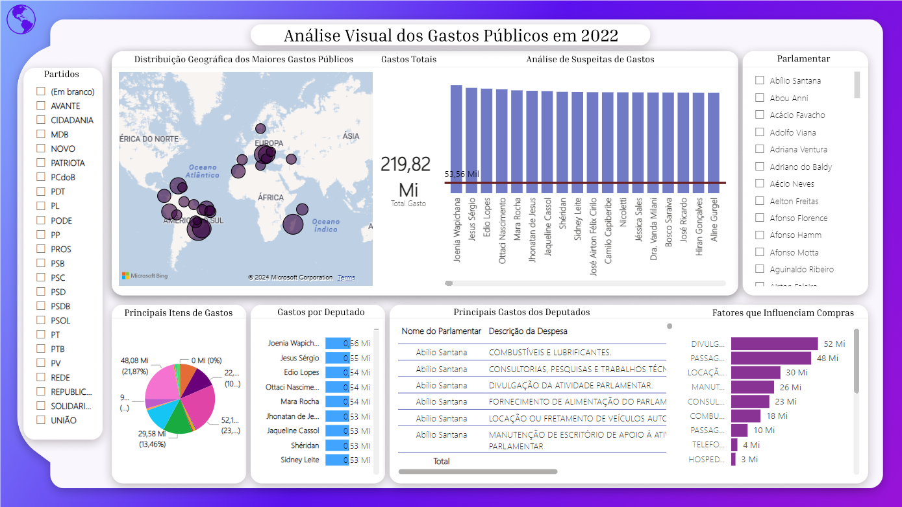
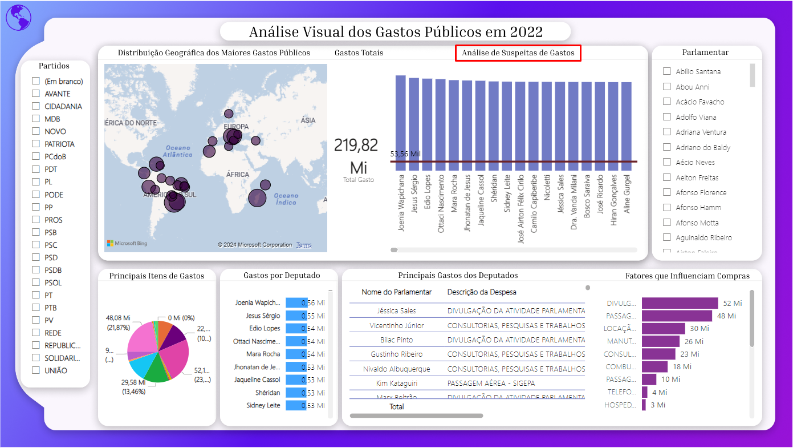

# 📊 Dashboard de Análise de Gastos Públicos

Bem-vindo ao repositório do **Dashboard de Análise de Gastos Públicos**! Este projeto foi desenvolvido para explorar e apresentar insights sobre os gastos da Câmara dos Deputados em 2022. Utilizamos **Power BI** para criar visualizações interativas que auxiliam na identificação de padrões e possíveis anomalias.

---

## 🎯 Objetivo do Projeto

O principal objetivo é fornecer uma análise detalhada dos dados públicos sobre os gastos dos deputados federais, promovendo maior transparência e permitindo uma compreensão aprofundada de como os recursos são alocados.

---

## 🛠️ Funcionalidades do Dashboard

- **📌 Segmentação por Partido e Parlamentar**: Analise os gastos por cada partido ou deputado específico.
- **🗺️ Distribuição Geográfica**: Explore os gastos distribuídos por Unidade Federativa (UF) em um mapa interativo.
- **🔍 Análise de Suspeitas de Gastos**: Identifique possíveis irregularidades nos gastos declarados.
- **📈 Principais Gastos**: Descubra os itens que representaram as maiores despesas públicas.
- **🤖 Fatores Influenciadores**: Entenda as variáveis que impactam os gastos dos deputados.

---

## 🚀 Como Acessar o Dashboard

1. **Baixe o arquivo `Análise-Visual-dos-Gastos-Públicos-em-2022.pbix`**:
   - Faça o download do arquivo Power BI disponibilizado no repositório.
2. **Abra no Power BI Desktop**:
   - Utilize o Power BI Desktop para abrir o dashboard e interagir com as visualizações.

---

## 📂 Estrutura do Repositório

```plaintext
├── dashboard_imagens/
│   ├── Visao_Geral.png           # Captura da visão geral do dashboard
│   ├── Gastos_Suspeitos.png      # Captura da análise de gastos suspeitos
├── Ano-2022 4.csv                # Base de dados bruta em formato CSV
├── Análise-Visual-dos-Gastos-Públicos-em-2022.pbix  # Dashboard em Power BI
├── Base_de_dados - Com csv.ipynb # Notebook para processamento de dados
├── Com_csv.py                    # Script Python para manipulação de dados
├── Relatório-Integrador-II.pdf   # Relatório final em formato PDF
├── README.md                     # Documentação do projeto

```

---

## 🌟 Capturas do Dashboard

### 🎯 Visão Geral


### 🔍 Análise de Gastos Suspeitos


*Mais imagens disponíveis na pasta `dashboard_imagens`.*

---

## 🖥️ Tecnologias Utilizadas

- **Power BI**: Para criação do dashboard e visualizações.
- **Python**: Para coleta e processamento dos dados.
- **PostgreSQL**: Para armazenamento estruturado dos dados.
- **API da Câmara dos Deputados**: Fonte dos dados públicos utilizados.

---

## 🤝 Contribuição

Contribuições são bem-vindas! Para colaborar:

1. Faça um fork do repositório.
2. Crie uma branch para sua contribuição:
   ```bash
   git checkout -b minha-contribuicao
3. Envie seu pull request.

## 📧 Contato
**Autor(a): Monniky Sabrinny Ribeiro Pereira**  
📩 Email: [monnikysabrinny@gmail.com](mailto:monnikysabrinny@gmail.com)  
🔗 GitHub: [Monniky Sabrinny](https://github.com/monnikys)

---

### Observações:
- As imagens devem ser salvas na pasta `dashboardimagens/` com os nomes `visao_geral.png` e `gastos_suspeitos.png` ou renomeadas conforme necessário para corresponder ao código.
- Substitua os links de contato, como o do GitHub, se houver atualizações.


